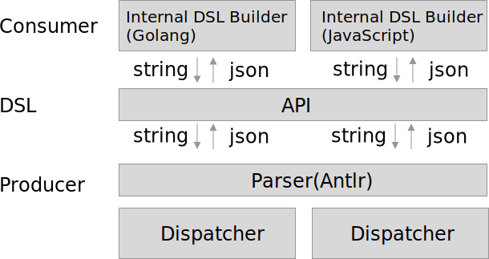

# DSL-based Composable application

Scene: cross domain

> A DSL as contract for orchestration API.



## Usage

Consumer <-> DSL(Protocol) <-> Producer

1. consumer, flow internal DSL to string as a protocol.
2. DSL, use antlr to generate lexer and parser
3. producer, parser string with language type,

```golang
compose := consumer.NewCompose()
compose.Source("12").Target("12.0")
contract := compose.Build()

fmt.Println(contract)
// output: Book.source(12).target(12.0)

flow := producer.Dispatcher(contract)
fmt.Println(flow)
// output: {"Id":"12","Title":"title","Name":"hello"}
```

### Consumer

output: generate string

see in [consumer.go](consumer/consumer.go)

```go
func (b *Compose) Source(id string) *Compose {
	source := "source(" + id + ")"
	b.builder.WriteString(source)
	return b
}

func (b *Compose) Target(id string) *Compose {
	source := ".target(" + id + ")"
	b.builder.WriteString(source)
	return b
}

func (b *Compose) Build() string {
	return "Book." + b.builder.String()
}

```

### Producer

> parse string and call function

#### parser: type system

```javascript
for (let literal of (ctx.parameterList() as ParameterListContext).literal()) {
    let tokenIndex = (literal.children[0].payload as CommonToken).type;
    let symbolicName = this.vocabulary.getSymbolicName(tokenIndex);

    let typeName = "";
    switch (symbolicName) {
        // ...
        default:
    }

    let paramType = new ParamType();
    paramType.TypeName = typeName;
    paramType.TypeValue = literal.text;
    codeCall.Parameters.push(paramType)
}

```

#### dispatcher


```javascript
export function Dispatcher(str: string) {
    let flow = Compile(str)
    switch (flow.Entity) {
        case "Book":
            let book = new Book();
            for (let call of flow.Calls) {
                switch (call.FunctionName) {
                    case "Target":
                        book.target()
                        break;
                    case "Source":
                        book.source(call.Parameters[0].TypeValue)
                        break;
                }
            }

            return JSON.stringify(book)
        default:
            return ""
    }
}
```